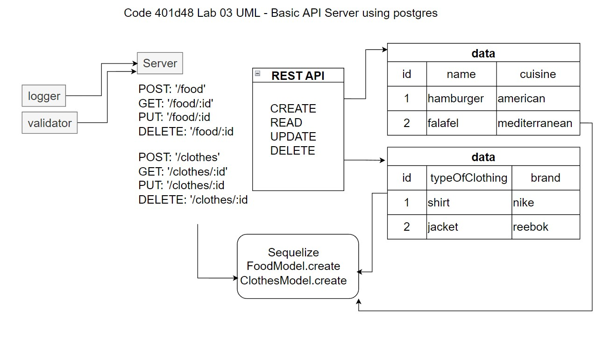

# Project: Basic API Server

## Author: Robert Ball

### Code 401d48 Lab 03

### Problem Domain

* Build a REST API using Express, by creating a proper series of endpoints that perform CRUD operations on a database, using the REST standard

Deployed production server: [Heroku - RDBALL Basic API Server](https://rdball-basic-api-server.herokuapp.com/)

---
Requirements:

* SQL Models
  * Create 2 SQL data models using the Sequelize library, make sure you export those model instances.
  * Make sure your Models are configured with your SQL dialect and can properly connect to your database.
    * Your models should have appropriate field names declared with specific sequelize DataTypes.

* Include testing to assert the following
  * 404 on a bad route
  * 404 on a bad method
  * The correct status codes and returned data for each REST route
    * Create a record using POST
    * Read a list of records using GET
    * Read a record using GET
    * Update a record using PUT
    * Destroy a record using DELETE

Documentation:



Dependencies

* `node`
* `dotenv`
* `express`
* `jest`
* `supertest`
* `sequelize`
* `sequelize-cli`
* `pg`
* `sqlite3`

Setup

1. Create repo or fork this repo
2. Add README
3. Add .gitignore for Node
4. Add the license of your choice
5. Clone repo to your local system
6. with the repo open in your editor of choice, run:

```code
npm init -y
```

then

```code
npm install dotenv express jest supertest sequelize sequelize-cli pg sqlite3
```

When your server is not running, use the command

```code
npm test
```
